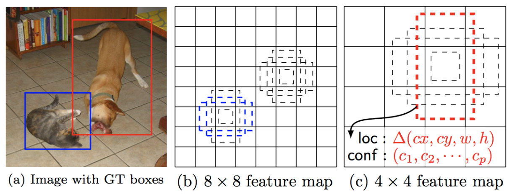
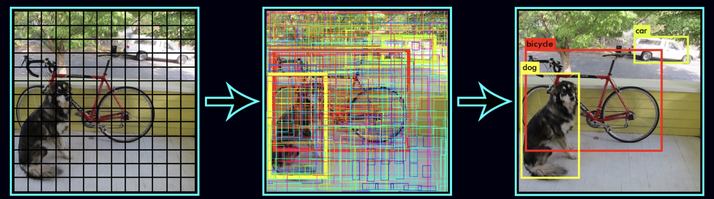

## Object Detection With Convolution Neural Nets

### Classification vs Detection
I often ponder neural networks trying to understand how they work. They're not so mysterious if you break down the internals and understand those fully first. When it comes to CNNs, classification is simpler to understand - the test sample either resembles what the model has learned to classify or not. For detection, it might be weird to explain how the CNN knows where an object is and what space in the image it occupies.
Joseph Redmon's [YOLO](https://arxiv.org/abs/1506.02640) and Wei Liu's [Multibox Detector](https://arxiv.org/abs/1512.02325) offer two CNN schemes for object detection. They differ slightly in implementation but one can deduce that the principle is the same, and this principle is what really explains how detection works.

#### ✨ "The principle" ✨
The images are convolved and pooled for several layers then finally pass through fully connected layers at the end. Convolution and pooling successively learn higher and higher level information and the fully connected layers act as regressors. 

They divide the image input into a grid of cells. Each cell has what they often call  `anchor boxes`. Anchor boxes are predifined example bounding boxes of different aspect ratios designed to impart aspect ratio robustness into the CNN. Looking at the image above, even when our arms were spread out the network was still able to detect me and my skilled teammate. Each anchor box has a box regressor that predicts the offsets of the box's corners from the anchor box's predefined location relative to its cell. Furthermore, each anchor box provides class predictions for each class the network is trained for. Concensus is taken by non-maximal supression and the object detections are returned with the top object probability as the confidence.

This is how the multibox detector does it.

*source: Multibox detector*

And this is how YOLO does it.

*source: YOLO*
